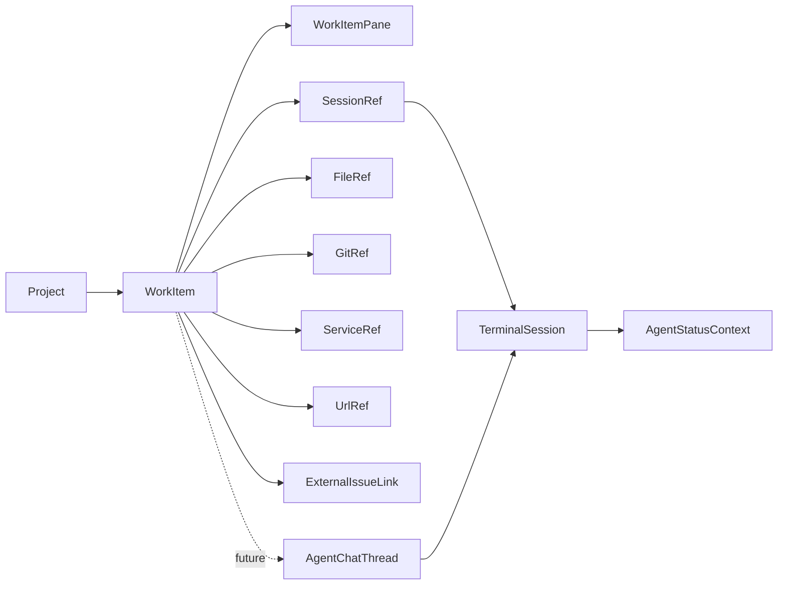

# Work Item-Centered Pane Architecture

Status: proposed design for [issue #27](https://github.com/artcodec-hq/parasor/issues/27)

## Recommendation

Adopt **Work Item First**.

`WorkItem` should be the durable planning and review object that connects a
project's execution and evidence surfaces. Terminal sessions remain the
canonical execution surface. Files, Git, services, and URLs remain owned by
their existing subsystems and are attached to a work item by reference rather
than copied into it.

Do not add an `agent-chat` pane in the first implementation. First ship a local
work item pane that can link existing terminal sessions and evidence. Add a
lightweight chat projection only after a focused experiment proves that a
supported agent can provide bounded, structured messages without treating PTY
output as chat history.

This sequence strengthens Parasor's mobile supervision workflow without turning
it into a general issue tracker, chat product, or autonomous task scheduler.

## Existing Boundaries

This proposal extends the current architecture instead of introducing a second
workspace model:

- `packages/shared/src/pane-model.ts` defines worktree-scoped pane identity and
  state.
- `packages/web/src/features/panes/pane-module-registry.ts` centralizes body vs
  layer presentation, close behavior, chrome, and sidebar descriptors.
- `packages/server/src/application/workspace/pane-commands.ts` persists and
  broadcasts server-owned pane mutations.
- `packages/shared/src/state.ts` and
  `packages/server/src/state/app-state.ts` define and normalize durable local
  state.
- `packages/shared/src/agent-status-context.ts` derives explainable live agent
  status without claiming task completion.
- `packages/shared/src/runtime-services.ts` exposes live service attribution.
- `packages/shared/src/runtime-api.ts` defines the intentionally small
  experimental automation contract.
- browser panes are currently a client-local projection in
  `packages/web/src/features/workspace/useClientBrowserPanes.ts`.

These boundaries explain why work item data belongs in server-owned app state,
why terminal remains a layer pane, and why durable URL evidence cannot point
only at a browser pane ID.

## Product Boundary

Parasor owns active workspace context:

- the local work item and its execution status;
- acceptance criteria and short local notes;
- links from the work item to sessions and evidence;
- pane placement, focus, close, and display state;
- explicit user actions that copy or post information elsewhere.

Existing subsystems remain authoritative for their data:

- the PTY host owns terminal sessions and output;
- agent detection owns liveness and signal confidence;
- the filesystem and file APIs own file content and previews;
- Git owns working-tree state, commits, branches, and diffs;
- runtime service discovery owns live service state;
- an external tracker owns its issue title, body, status, and comments;
- a browser pane owns only its current client-side view state.

A work item summarizes and links these surfaces. It does not archive terminal
bytes, copy file contents, snapshot an unbounded diff, or mirror an external
issue database.

## Central Object And Scope

The central object is `WorkItem`, not `Session`, `Pane`, or `AgentRun`.

- A session can end and restart while the task remains active.
- A pane is a view instance and can be closed without deleting task data.
- A work item can span multiple sessions and evidence types.
- An agent run is not a reliable universal concept for PTY-first agents.

Each work item belongs to exactly one Parasor project. It may have a primary
worktree for navigation, but the project is the durable ownership boundary. A
project-level item can therefore survive a linked worktree being renamed or
removed, while each attachment still records the worktree it was created from.



## Minimal Shared Types

The names can change during implementation, but the ownership and bounds are
part of this design.

```ts
export type WorkItemStatus =
  | "todo"
  | "in_progress"
  | "blocked"
  | "review"
  | "done";

export interface WorkItem {
  id: string;
  projectId: string;
  primaryWorktreePath?: string;
  title: string;
  status: WorkItemStatus;
  acceptanceCriteria: WorkItemCriterion[];
  notes?: string;
  externalIssue?: ExternalIssueLink;
  attachments: WorkItemAttachment[];
  createdAt: number;
  updatedAt: number;
}

export interface WorkItemCriterion {
  id: string;
  text: string;
  checked: boolean;
}

export interface ExternalIssueLink {
  provider: "github";
  repository: string;
  number: number;
  url: string;
  lastReadAt?: number;
}

export type WorkItemAttachment =
  | {
      id: string;
      kind: "session";
      sessionId: string;
      worktreePath: string;
      attachedAt: number;
    }
  | {
      id: string;
      kind: "file";
      worktreePath: string;
      path: string;
      selection?: { startLine: number; endLine: number };
      attachedAt: number;
    }
  | {
      id: string;
      kind: "git";
      worktreePath: string;
      target:
        | { type: "working-tree" }
        | { type: "commit"; sha: string };
      attachedAt: number;
    }
  | {
      id: string;
      kind: "service";
      worktreePath: string;
      serviceId: string;
      urlAtAttach?: string;
      attachedAt: number;
    }
  | {
      id: string;
      kind: "url";
      url: string;
      label?: string;
      attachedAt: number;
    };
```

The first implementation should apply explicit bounds during normalization and
mutation. Suggested starting limits are a 200-character title, 50 acceptance
criteria, 500 attachments, and 64 KiB of notes per work item. These are safety
limits, not product targets, and should be constants covered by tests.

`ExternalIssueLink.provider` intentionally supports GitHub only in the first
version. A generic provider/plugin abstraction is premature. Adding another
provider should require a deliberate new union member and adapter.

### Future Chat Types

Chat is a bounded projection, not a transcript of the terminal.

```ts
export interface AgentChatThread {
  id: string;
  projectId: string;
  workItemId?: string;
  sessionIds: string[];
  title: string;
  entries: AgentChatEntry[];
  createdAt: number;
  updatedAt: number;
}

export interface AgentChatEntry {
  id: string;
  role: "user" | "assistant" | "tool";
  text: string;
  sessionId: string;
  source: "user-send" | "validated-native-event";
  sourceEventId?: string;
  createdAt: number;
}
```

A thread should have both an entry-count cap and a serialized-byte cap. Only
text explicitly sent through the chat UI or received through a validated native
integration may become an entry. Output observation, prompt heuristics, and raw
PTY replay must never be promoted into structured chat messages.

## Local Todos And External Issues

A local work item is fully owned by Parasor. A linked external issue combines
two independent pieces of state:

- Parasor owns the work item status, criteria, notes, attachments, and primary
  worktree.
- The external tracker owns its issue fields and comments.

Parasor may fetch a bounded external issue projection for display. The stored
link contains identity and read metadata, not a second authoritative copy of
the issue. A stale or unavailable provider must not make the local work item
unusable.

Linking an external issue does not automatically synchronize the local work
item status. This avoids ambiguous mappings such as a locally active task whose
external issue is still open, or a closed external issue that needs local
verification.

Every external write is a separate, explicit user action:

1. The user selects **Post update**.
2. Parasor shows the target repository and issue number.
3. Parasor shows the exact comment body and whether it was generated or copied.
4. The user confirms the write.
5. Parasor reports the provider result without changing unrelated local state.

Credentials remain in the provider integration. They are never stored in a
work item or pane state.

## Pane Model

Add two state shapes to the shared pane union, but implement only `work-item` in
the first slice:

```ts
export interface WorkItemPaneState {
  kind: "work-item";
  workItemId: string;
}

export interface AgentChatPaneState {
  kind: "agent-chat";
  threadId: string;
}
```

Pane state contains only the domain object identifier. Editing a work item does
not rewrite every pane that displays it, and closing a pane never deletes the
work item.

Both kinds are ordinary focused body panes, not persistent layers. Terminal
remains the only layer-rendered pane because its mounted PTY lifecycle and
visibility behavior are special. The pane module registry declares:

| Kind | Presentation | Closable | Inner chrome | Sidebar child |
|---|---|---:|---:|---:|
| `work-item` | body | yes | yes | yes |
| `agent-chat` | body | yes | yes | yes |
| `terminal` | layer | yes | yes | yes |

Work item and chat panes are attached to a worktree row for navigation. Their
domain objects remain project-scoped. Opening an item from another worktree may
create another pane pointing to the same `workItemId`; the implementation must
not clone the item.

The canonical pane order becomes `files`, `work-item`, `terminal`, future
`agent-chat`, `browser`, then `git`. Multiple panes of the same kind preserve
insertion order, and existing user sidebar order overrides continue to win.

Pane lifecycle behavior is explicit:

- **Create/open:** a worktree action opens a picker for existing project work
  items or creates a new item, then creates a pane referencing the selected ID.
- **Focus:** use the existing pane focus pointer and `/panes/:paneId` route.
- **Close:** close only the pane. Because work item edits persist through domain
  commands, closing does not delete the item or require a destructive warning.
- **Reopen:** the worktree action can reopen any project item, including one
  whose last pane was closed.
- **Removed worktree:** existing reconciliation may drop the pane with its
  vanished worktree row, but it must not delete the project-owned work item. The
  item remains reopenable from another registered worktree, with stale
  attachments identified explicitly.
- **Pin:** do not add generic pane pinning in the MVP. Work items are already
  durable, while the existing terminal pin belongs to session lifecycle.
- **Split:** do not add arbitrary pane splitting in the MVP. Attachments use the
  existing file preview or navigate to their existing pane. A general split
  layout remains a separate workspace decision.

On narrow layouts, the pane uses the same workspace header and full-width body
as existing panes. Attachments open existing surfaces one at a time. The MVP
does not add a new split-layout system.

## Persistence And Events

Do not put work items inside `ProjectState`. `ProjectState` currently mixes pane
layout, focus, sidebar preferences, and worktree metadata; work items are domain
data with an independent lifecycle.

Add a server-owned top-level domain to `AppState`:

```ts
interface AppState {
  // existing fields
  workItems: Record<string, WorkItem[]>; // projectId -> items
}
```

The app-state loader must backfill missing domains, normalize every item, drop
invalid entries, and preserve the existing state version compatibility policy.
Project deletion must remove its work items and future chat threads in the same
mutation that removes project state.

Do not add `agentChatThreads` until the structured chat experiment is accepted.
If accepted, it becomes a separate top-level domain rather than a field nested
inside work items or pane state.

Add focused websocket events rather than rebroadcasting the whole app snapshot
after every edit:

```ts
type WorkItemEvent =
  | { type: "work-item-created"; item: WorkItem }
  | { type: "work-item-updated"; item: WorkItem }
  | { type: "work-item-deleted"; projectId: string; workItemId: string };
```

Hydration includes normalized work items. A later chat implementation should
use bounded thread events and must not place unbounded histories in the initial
snapshot.

## Linking And Resolution Rules

Attachments are references that are resolved when displayed:

- **Session:** require `session.projectId === workItem.projectId`. Show current
  `AgentStatusContext` by deriving it from the linked session and agent state.
  Ended or missing sessions remain visible as stale evidence; they do not imply
  task completion.
- **File:** require a registered worktree for the same project and reuse the
  existing fenced file preview. Store a relative path and optional line range,
  never file content. Batched file changes or overflow refresh the existing
  live surfaces; they do not rewrite or duplicate the attachment.
- **Git:** resolve working-tree evidence live. A commit SHA is immutable
  evidence; a `working-tree` target is explicitly live and may change. A richer
  structured Git model can improve the resolved display without migrating the
  attachment identity.
- **Service:** require matching project/worktree attribution when attaching.
  Resolve by service ID while live and fall back to `urlAtAttach` with a stale
  label after discovery loses it.
- **URL:** validate `http:` or `https:` using the existing browser URL policy.
  Store the URL, not a client browser pane ID, because browser panes currently
  live in per-browser local storage.
- **External issue:** validate provider identity and repository/issue syntax.
  Provider reads and writes remain separate from local attachment mutations.

An attachment that can no longer resolve is not silently deleted. The pane
shows why it is stale and lets the user remove or replace it.

## User-Controlled Flows

### Create From Terminal Context

1. The user opens a terminal pane menu and chooses **Create work item**.
2. Parasor preselects the project, worktree, and current session.
3. The user enters a title and optional criteria.
4. Parasor creates the item, attaches the session, and opens a work item pane.

No terminal output is copied automatically.

### Attach Evidence

The user chooses **Attach to work item** from a file preview, Git selection,
service/port row, or URL. Parasor shows the target work item and the exact
reference before saving it. Opening an attachment delegates back to the
existing file, Git, terminal, or browser surface.

### Create From Future Chat

A future chat pane may create a work item with the thread and backing session
attached. It copies only user-selected bounded text into criteria or notes. The
chat history itself remains a separate bounded projection.

### Send From Future Chat

Sending text to a PTY-backed agent is an explicit terminal input action. It must
reuse session existence checks, generation fencing, byte limits, and the
existing authorization boundary. The UI shows the exact payload before the
first send to a newly linked session. No background continuation is implied.

## Multi-Pane Coordination Boundary

If the manager/worker workflow from issue #8 is adopted later, a work item is
the maximum coordination boundary:

- a manager selects target sessions already attached to the same work item;
- every target must belong to the same project, and cross-worktree targets are
  shown explicitly;
- delegated instructions and results reference the work item ID;
- status is derived from each session's current `AgentStatusContext`;
- interruption and input remain explicit per-session actions;
- attaching a session does not grant new command, file, Git, or external-write
  authority;
- no manager loop, automatic retry, duplicate send, or completion inference is
  introduced by the work item model.

This makes task context available to future coordination without placing an
orchestrator or scheduler inside the work item domain.

## Runtime API Boundary

Do not add work item or chat methods to `runtime.v1` in the MVP.

The first work item pane is a local UI workflow backed by normal authenticated
HTTP commands and websocket events. Exposing work item mutation to automation
too early would blur the boundary with autonomous scheduling and external issue
writes.

After the model is stable, a read-only `work-item.list` method can be evaluated.
Any future write method must use explicit project and work-item selectors and
must not post external comments, send terminal input, or change Git state as a
side effect.

## Safety And Privacy

- Every command requires a project ID and validates the referenced work item.
- Worktree paths use the existing registered-worktree fencing.
- Session attachments require same-project ownership.
- File paths remain relative and use existing file access controls.
- Terminal sends retain generation checks and input byte limits.
- External writes require a visible target, exact payload, and confirmation.
- External credentials and tokens are never serialized into app state.
- Notes, criteria, attachments, external projections, and future chat entries
  are bounded during both request validation and persisted-state normalization.
- Low-confidence agent status never becomes a work item status transition.
- Deleting a work item does not close sessions, delete files, mutate Git, stop
  services, close external issues, or remove browser history.

## MVP Sequence

### Slice 1: Work Item Domain

- Add shared work item types, limits, and normalization.
- Add the top-level app-state domain and migration/backfill tests.
- Add create, update, delete, and list application commands.
- Add hydration and focused websocket events.
- No pane UI, external provider, chat storage, or automation API yet.

### Slice 2: Work Item Pane

- Add `work-item` to `PaneKind` and `PaneState`.
- Register its body presentation, close behavior, chrome, and sidebar icon.
- Add pane create/close/focus behavior and worktree reconciliation coverage.
- Render title, status, criteria, notes, and empty attachment state.
- Support desktop and narrow layouts through the existing pane router.

### Slice 3: Local Evidence Attachments

- Attach and open existing sessions, files, Git targets, services, and URLs.
- Resolve current agent status without persisting a duplicate status.
- Show missing/stale targets explicitly.
- Add user-controlled creation from terminal and attachment entry points.

### Slice 4: GitHub Issue Link

- Add read-only GitHub issue linking and bounded display.
- Keep local status independent from external issue state.
- Add an explicit preview-and-confirm comment action.
- Do not add general provider plugins or background bidirectional sync.

### Slice 5: Structured Chat Experiment

- Test one validated native integration with bounded structured events.
- Prove deduplication, session identity, reconnect, and byte/count limits.
- Decide whether an `agent-chat` pane is useful beyond the terminal.
- Reject the pane if the only reliable source is reconstructed PTY output.

## Follow-Up Implementation Issues

Create separate implementation issues after this design is accepted:

1. **Add normalized work item storage and events.** Covers Slice 1 only.
2. **Add the work item pane module and local editor.** Covers Slice 2 only.
3. **Link sessions and local evidence to work items.** Covers Slice 3 only.
4. **Link GitHub issues with explicit outbound comments.** Covers Slice 4 only.
5. **Evaluate bounded native agent chat events.** Runs the Slice 5 experiment;
   it does not assume the chat pane will be adopted.

Each issue should carry its own migration, security, unit, and browser evidence
criteria. Do not combine all slices into one PR.

## Focused Verification Plan

### Shared And Server

- work item normalization, limits, unknown fields, and malformed attachments;
- legacy app-state backfill and round-trip persistence;
- project deletion cleanup;
- same-project session and service attachment validation;
- worktree and file-path fencing;
- event ordering and hydration after create/update/delete;
- no implicit external, terminal, file, or Git side effects.

### Web

- pane registry exhaustiveness after adding `work-item`;
- pane model ordering, focus fallback, close behavior, and reconciliation;
- active and inactive sidebar projection;
- desktop and narrow work item rendering;
- stale/missing attachment states;
- agent status projection without persisted status mutation;
- explicit external-comment preview and cancellation.

### Browser Evidence

- create a local item from a terminal context;
- edit criteria and notes on desktop and mobile widths;
- attach and reopen a session, file, Git target, service, and URL;
- reload and reconnect without losing the item or pane;
- close a pane without deleting the item;
- confirm that an external write cannot occur without the preview step.

## Rejected Alternatives

### Session-Centered

Rejected because sessions are execution resources with shorter lifecycles than
tasks. A task often spans multiple sessions or survives an ended session.

### Pane-Centered

Rejected because panes are navigation/view state. Closing a view must not
delete durable planning context.

### Chat First

Deferred because PTY-first agents do not expose a universal structured chat
protocol. Reconstructing chat from terminal bytes would create false structure,
unbounded storage pressure, and agent-specific parsing.

### Work Item And Chat Together

Rejected for the MVP because it couples a well-defined local task model to an
unproven message source and doubles the first migration and UI surface.

### Full External Tracker Sync

Rejected because it makes Parasor responsible for provider workflows,
conflicts, credentials, and background synchronization unrelated to active
workspace supervision.

## Decision

Adopt a project-owned `WorkItem` domain and a closable, worktree-located
`work-item` pane. Implement local work items and evidence links first. Keep
terminal as the canonical execution surface, derive agent status live, and
leave external systems authoritative. Defer `agent-chat` until a bounded native
event experiment demonstrates value that the terminal pane cannot provide.
